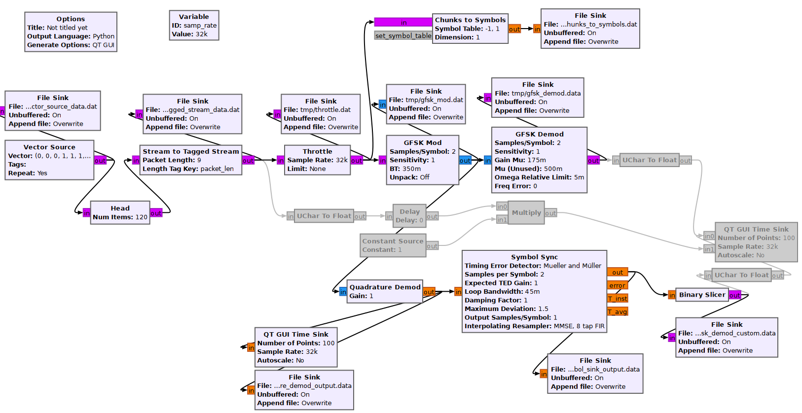
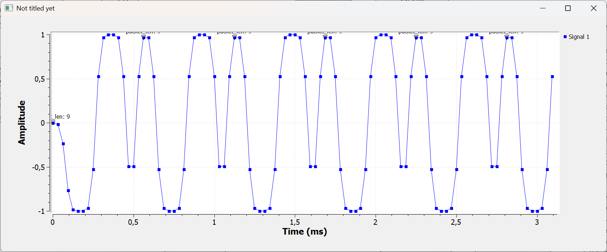

# Introduction

The basic purpose of this test is to decode Bluetooth Low Energy advertisement packets using a HackRF One or similar Software Defined Radio and gnuradio. This repository does not use the GNURadio Companion GUI but it executes a Python script on the command line. The solution works on Microsoft Windows 11.

The original repository for sdr4iot-ble-rx is located here: https://github.com/Rtone/sdr4iot-ble-rx
The original repository is created for gnuradio 3.7. Since gnuradio 3.7 is deprecated, the original repository is not of great use any more.

An up-to-date version is contained here: https://github.com/oldprogram/sdr4iot-ble-rx
The updated fork works for gnuradio 3.10 on Microsoft Windows!

# How to run the application 

1. Clone the repository

```
git clone https://github.com/oldprogram/sdr4iot-ble-rx
```

2. Install gnuradio and a working python environment by installing radioconda on Microsoft Windows.
The homepage is https://github.com/ryanvolz/radioconda
Search for Releases and go to the Releases page.
On the Releases page select the newest release, scroll down to the Assets and click on "Show all xy assets".
In the unfolded list, select "radioconda-2025.03.14-Windows-x86_64.exe", download the .exe installer file
and run the installer.

# Necessary changes

As the python scripts have been developed on Linux, some changes are required to make them run in a Microsoft Windows environment.

## Replace the /dev/null file by os.devnull

TIPP: When you open the file gr_ble.grc in GNU Radio Companion and save the graph, the file gr_ble.py
that is edited in the following is regenerated! This means, this section tells you to edit a generated
file! That is never a good idea but there is no way around it!

/dev/null is a Linux file. A platform independent variant of that file is available using os.devnull
In order to make the script run on Microsoft Windows, we need to use a platform independent version.

Edit gr_ble.py and add an import for os

```
import os
```

Replace the line

```
self.iq_output = iq_output = "/dev/null"
```

by

```
self.iq_output = iq_output = os.devnull
```

# Now install radioconda and the sdr4iot-ble-rx dependencies

The trick is to install gnuradio on windows using radioconda.
Since gnuradio is tightly coupled with python, you always need python to run gnuradio scripts anyways.
GNU Radio Companion (GRC) is a GUI which lets you define graphs that are compiled to python scripts.

When the graph is executed, you actually execute a python script! The original GNU Radio Companion
graph is contained in the sdr4iot-ble-rx repository! The file is located here: sdr4iot-ble-rx\grc\gr_ble.grc
You can open this file in GNU Radio Companion (grc) 3.10.12.0 (Python 3.12.9) for example. 

Once you generate the flowgraph (MenuBar > Box with an triangle below it pointing downwards), the gr_ble.grc graph
is converted into the python script gr_ble.py. This script contains blocks that can be imported into other python
scripts. The gr_dump.py python script makes use of the gr_ble.py by importing it first:

```
from grc.gr_ble import gr_ble as gr_block
```

The graph starts with the RTL-SDR source configured to use a Hack-RF and scanning the frequency 2.426 Ghz.
With 10 Million Samples Per Second. Then it uses a https://wiki.gnuradio.org/index.php/Head block.
A head block is configured with a number that is the number of packets it passes on before it stops
transmitting packets downstream. This means it is purely used for limiting the amount of data that flows
through the system in order to not completely fill the harddrive with huge files for example!

Looking at the graph, the data flows from left to right and enters a ZMQ (Zero MQ, High Performance Message Queuing for Python)
sink. The sink opens up a socket on localhost and port 55555. (tcp://127.0.0.1:55555)
The sdr-dump.py python script from the sdr4iot-ble-rx repository, first executes the grc graph
and then connects to that socket and port. 

The sdr-dump.py script reads records from the socket. 
For each record, it first extracts the BLE Access Address.
Then it performs deswhitening on the BLE header.
It checks the PLDU type and retrieves the packet length.
It then performs dewithening on the rest of the BLE packet
and verifes the checksum.

radioconda seems to be a packaged python environment including gnuradio and the required python libraries.

I do actually not understand what radioconda really is but once installed, your
Windows start menu contains the application "radioconda Prompt".
The radioconda Prompt is a command line window which contains a python environment
with all packages for gnuradio!

Once the radioconda Prompt is opened, first install the required python packages for
sdr4iot-ble-rx

```
pip install zmq
pip install numpy
```

Plug in your SDR. I tested it using a HackRF One but it works with many SDRs.
The script will automatically detect your SDR, at least it detected and used my HackRF One
without me configuring any settings or providing any command line parameters.

You can then execute the python script within radioconda Prompt. 

```
cd C:\Users\lapto\dev\gnuradio\sdr4iot-ble-rx
python ./ble_dump.py -o tmp/dump1.pcap --iq-output=tmp/iq_output.dat
```

A few bits of information for the ble_dump.py script:
DO NOT NAME THE --iq-output file .csv! USE ANY OTHER EXTENSION. THE REASON IS, ble_dump.py WILL CREATE A .csv FILE ITSELF AUTOMATICALLY!
The ble_dump script will reuse the name of the --iq-output file and add
the .csv extension to the file and then create that .csv file.
It will enter some statistics data into the .csv file.
One very important piece of information is, where within the IQ-Data
a packet starts (Start_frame) and ends (End_frame). You can then easily point any decoder software
directly at those offsets into the IQ-Data file instead of decoding the entire IQ-Data file!

# Interpreting the output of sdr4iot-ble-rx

The command

```
cd C:\Users\lapto\dev\gnuradio\sdr4iot-ble-rx
python ./ble_dump.py -o tmp/dump1.pcap --iq-output=tmp/iq_output.dat
```

executes the python script. The python script starts to capture incoming
advertisement packets on the first advertisement channel 37. After a certain
amount of time it will switch to the next advertisement channel and capture
packets there. This means, you should let the applicatio run for a couple of
seconds before stopping it. If you stop it too early, it will probably not 
have the chance to capture any packets.

Be warned, the iq_output.csv is getting huge very, very quickly. I ran the 
script for 30 seconds which resulted in a 2 GB iq_output.csv file!

The script creates a subfolder called tmp acording to the command line parameters
given above. Within the tmp folder, there will be two files dump1.pcap and iq_output.csv.

The dump1.pcap file can be opened using Wireshark. Wireshark is a GUI which 
can decode packages from many communication protocols including Bluetooth.

A great way to generate advertisement packets for sdr4iot-ble-rx to pick up
is to install the Android app called nRF Connect. 
Switch to the ADVERTISER tab and start the advertiser.
The advertiser will blast all advertisement channels with packets advertising
your phone. sdr4iot-ble-rx will capture these packets within seconds. That
way, the iq_output.csv file stays relatively small. I managed to capture
four advertisement packets and the iq_output.csv file has been 400 MB.


# Understanding the GNU Radio Source Code

C:\Users\lapto\dev\gnuradio\docs\usage-manual\(exported from wiki) Handling Flowgraphs.txt


# Understanding the implementation of the GSFK Mod and Demod blocks.

To see both blocks in action, open and run the exampe graph: C:\Users\lapto\dev\gnuradio_test\sdr_testing\ble_decoding_using_sdr4iot-ble-rx\gfsk_test_gnu_radio_companion\gfsk_test_graph.grc

Both blocks are defined within the same .py file: gr-digital\python\digital\gfsk.py

Both are hiearchical blocks. https://wiki.gnuradio.org/index.php/Hier_Blocks_and_Parameters
A hierarchical block combines existing functionality into a new block.

In python, the Mod and Demod classes derive from the hier-class:

```
class gfsk_mod(gr.hier_block2):

...

class gfsk_demod(gr.hier_block2):

...
```

## GFSK Mod

gr-digital\python\digital\gfsk.py

The __init__() function is the constructor. The parameters to the constructor will 
show in the GNU Radio Companion GUI dialog, when you double click the node.

First, the constructor of the parent class is called.

```
gr.hier_block2.__init__(self, "gfsk_mod",
						# Input signature
						gr.io_signature(1, 1, gr.sizeof_char),
						gr.io_signature(1, 1, gr.sizeof_gr_complex))  # Output signature
```

After that, the code inside __init__() assigns the parameters to member variables.

To understand the rest of the code, we first take a look at the bottom of the __init__() function.

```
# Connect & Initialize base class
if do_unpack:
	self.unpack = blocks.packed_to_unpacked_bb(1, gr.GR_MSB_FIRST)
	self.connect(self, self.unpack, self.nrz,
				 self.gaussian_filter, self.fmmod, self.amp, self)
else:
	self.connect(self, self.nrz, self.gaussian_filter,
				 self.fmmod, self.amp, self)
```

Because Mod and Demod are derived from hier_block2, they can call the connect() method.
This connect method takes a set of objects that will connected to each other in line which
forms the content of the hierarchical block.

We can see that the sequence consists of:

1. self
1. self.unpack (only if configured on the block in the GRC)
1. self.nrz (I think this will map a 0 to a -1 and a 1 to 1 according to the mapping given [-1, 1]. The used implementation is
digital.chunks_to_symbols_bf([-1, 1]). I think the _bf suffix means byte to float which is one of the options available in GRC.)
1. self.gaussian_filter
1. self.fmmod
1. self.amp
1. self

The first and last nodes are the class itself (self). 
In between there is unpack, nrz, gaussian_filter, fmmod and amp.

The code in the middle of the __init__() function creates the middle
nodes in the chain above.

The next question is, where is the code for unpack, nrz, ... and the rest?

## unpack

unpack is created using blocks.packed_to_unpacked_bb:

```
self.unpack = blocks.packed_to_unpacked_bb(1, gr.GR_MSB_FIRST)
```

Files:

```
gr-blocks\include\gnuradio\blocks\packed_to_unpacked.h
gr-blocks\include\gnuradio\blocks\unpacked_to_packed.h
gr-blocks\python\blocks\bindings\packed_to_unpacked_python.cc
```

TODO: uncover the rest of the mystery

## NRZ

```
self.nrz = digital.chunks_to_symbols_bf([-1, 1])
```

The suffix _bf probably means that bytes are converted to float in a NRZ (Non return to zero) manner.
I think the non return to zero business can just be ignored. 0 is mapped to -1 and 1 is mapped to 1.
Checking the output using a "File Sink" and a hex editor, the 9 byte long input:
00 00 00 01 01 01 00 01 01
is converted to 
00 00 80 BF 00 00 80 BF 00 00 80 BF 00 00 80 3F 00 00 80 3F 00 00 80 3F 00 00 80 BF 00 00 80 3F 00 00 80 3F
first, lets mark the 32-bit floats in the output.
[00 00 80 BF] [00 00 80 BF] [00 00 80 BF] [00 00 80 3F] [00 00 80 3F] [00 00 80 3F] [00 00 80 BF] [00 00 80 3F] [00 00 80 3F]
The hex editor HxD (https://mh-nexus.de/de/hxd/) is able to decode the selected byte on the fly in a myriad of formats.
Looking at "Single (float32)" we get for each 4 bytes:
-1, -1, -1, 1, 1, 1, -1, 1, 1
Now lets convert the data back by performing the invers mapping -1 becomes 0 and 1 becomes 1.
0, 0, 0, 1, 1, 1, 0, 1, 1

To test digital.chunks_to_symbols_bf in GNU Radio Companion, use "Chunks to Symbols" with a symbol table of [-1, 1]
and set Dimensions to 1.

Files:

It seems as if the template is defined in the header (chunks_to_symbols.h).
It seems as if the implementation is contained in chunks_to_symbols_impl.h/.cc
It seems as if the python binding is contained in chunks_to_symbols_python.cc

```
gr-digital\include\gnuradio\digital\chunks_to_symbols.h
gr-digital\lib\chunks_to_symbols_impl.h
gr-digital\lib\chunks_to_symbols_impl.cc
gr-digital\python\digital\bindings\chunks_to_symbols_python.cc (This file is automatically generated using bindtool!)
```

TODO:

look at

```
template <class IN_T, class OUT_T>
int chunks_to_symbols_impl<IN_T, OUT_T>::work(int noutput_items,
                                              gr_vector_const_void_star& input_items,
                                              gr_vector_void_star& output_items)
```

in gr-digital\lib\chunks_to_symbols_impl.cc

# Gaussian Filter

Next the mapped data -1, -1, -1, 1, 1, 1, -1, 1, 1 is sent through a gaussian filter.
This filter is built using taps. (What is a tap!?!).
The taps are created by numpy.convolve()

```
samples_per_symbol = 2 	# taken from configuration of GFSK_MOD in official example
bt = 0.35 				# taken from configuration of GFSK_MOD in official example

ntaps = 4 * samples_per_symbol	# up to 3 bits in filter at once

# Form Gaussian filter
# Generate Gaussian response (Needs to be convolved with window below).
self.gaussian_taps = filter.firdes.gaussian(
	1.0,		       		# gain
	samples_per_symbol,    	# symbol_rate
	bt,		       			# bandwidth * symbol time
	ntaps                  	# number of taps
)

# rectangular window
self.sqwave = (1,) * samples_per_symbol

self.taps = numpy.convolve(numpy.array(self.gaussian_taps), numpy.array(self.sqwave))

self.gaussian_filter = filter.interp_fir_filter_fff(
                           samples_per_symbol, self.taps)
```

### gaussian_taps

The gaussian_taps are are created with:

```
self.gaussian_taps = filter.firdes.gaussian(
	1.0,		       		# gain
	samples_per_symbol,    	# symbol_rate
	bt,		       			# bandwidth * symbol time
	ntaps                  	# number of taps
)
```

C:\Users\lapto\dev\gnuradio\gr-filter\docs\filter.dox

"firdes" bei Filtern steht für "Finite Impulse Response Filter Design"

\li gr::filter::firdes::gaussian: creates a Gaussian pulse shaping filter.

C:\Users\lapto\dev\gnuradio\gr-filter\python\filter\bindings\firdes_python.cc

```
.def_static("gaussian",
                    &firdes::gaussian,
                    py::arg("gain"),
                    py::arg("spb"),
                    py::arg("bt"),
                    py::arg("ntaps"),
                    D(firdes, gaussian))
```

gain is 1.0 see sourcecode
spb is samples_per_symbol variable from source code (configured to 2)
bt is bandwidth * symbol time
ntaps is number of taps = (ntaps = 4 * samples_per_symbol)

The C++ firdes class can be found, by opening firdes_python.cc and 
using "Go to Definition" on the firdes_class variable.

The firdes class is contained in C:\Users\lapto\dev\gnuradio\gr-filter\include\gnuradio\filter\firdes.h

```
/*!
     * \brief design a Gaussian filter
     *
     * \param gain    overall gain of filter (typically 1.0)
     * \param spb     symbol rate, must be a factor of sample rate
     * \param bt      bandwidth to bitrate ratio
     * \param ntaps   number of taps
     */
    static std::vector<float> gaussian(double gain,
                                       double spb,
                                       double bt, // Bandwidth to bitrate ratio
                                       int ntaps);
```

The implementation is located in C:\Users\lapto\dev\gnuradio\gr-filter\lib\firdes.cc

```
//
// Gaussian
//

vector<float> firdes::gaussian(double gain, double spb, double bt, int ntaps)
{
    vector<float> taps(ntaps);
    double scale = 0;
    double dt = 1.0 / spb;
    double s = 1.0 / (sqrt(log(2.0)) / (2 * GR_M_PI * bt));
    double t0 = -0.5 * ntaps;
    double ts;
    for (int i = 0; i < ntaps; i++) {
        t0++;
        ts = s * dt * t0;
        taps[i] = exp(-0.5 * ts * ts);
        scale += taps[i];
    }
    for (int i = 0; i < ntaps; i++)
        taps[i] = taps[i] / scale * gain;

    return taps;
}
```

This means, the taps are a vector of floats. We can compute that vector using the C++ code above.

### Building samples_per_symbol

```
# rectangular window
self.sqwave = (1,) * samples_per_symbol
```

What is this wierd code doing?
Ask the Google KI:

```
Übersicht mit KI
The expression (1,) * samples per symbol creates a tuple containing a single element, 
the number 1, repeated samples per symbol times. 

In essence, it's a concise way to generate a sequence of ones with a specified length. 
For example, if samples per symbol is 4, the expression will result in the tuple (1, 1, 1, 1).

Explanation:
` (1,)`:
This creates a tuple containing a single element, the integer 1. 
The trailing comma is crucial; without it, (1) would be interpreted as the integer 1, not a tuple.

* samples per symbol:
This operator, when applied to a tuple and an integer, repeats the tuple that many times, concatenating the copies. In this case, the tuple (1,) is repeated samples per symbol times. 

Example:
If samples per symbol is 3, then:
(1,) creates the tuple (1,).
(1,) * 3 repeats the tuple three times, resulting in (1, 1, 1).
```

For the sample graph:
C:\Users\lapto\dev\gnuradio_test\sdr_testing\ble_decoding_using_sdr4iot-ble-rx\gfsk_test_gnu_radio_companion\gfsk_test_graph.grc
samples_per_symbol is 2

So we get: (1, 1)

### numpy.convolve

```
self.taps = numpy.convolve(numpy.array(self.gaussian_taps), numpy.array(self.sqwave))
```

numpy.array() - creates a numpy specific array datatype 
https://numpy.org/devdocs/reference/generated/numpy.array.html

numpy.convolve() - Returns the discrete, linear convolution of two one-dimensional sequences.
https://numpy.org/doc/stable/reference/generated/numpy.convolve.html#numpy-convolve

The convolution operator is often seen in signal processing, where it models the effect of 
a linear time-invariant system on a signal [1]. In probability theory, the sum of two 
independent random variables is distributed according to the convolution of their individual 
distributions.

https://stackoverflow.com/questions/20036663/understanding-numpys-convolve

https://docs.python.org/3/library/venv.html

cd C:\Users\lapto\dev\python\numpy\convolve
python -m venv /path/to/new/virtual/environment
python -m venv venv
venv\Scripts\activate.bat
pip install numpy


### gaussian_filter

The gaussian filter is in fact a interpolating fir filter fff.

```
self.gaussian_filter = filter.interp_fir_filter_fff(
	samples_per_symbol, self.taps)
```

The implementation of the interpolating FIR filter is located in C:\Users\lapto\dev\gnuradio\gr-filter
https://www.gnuradio.org/doc/doxygen-3.6/classgr_1_1filter_1_1interp__fir__filter__fff.html

Examples:

```
C:\Users\lapto\dev\gnuradio\gr-filter
gr-filter\examples\fft_filter_ccc.py
gr-filter\examples\fir_filter_fff.py
gr-filter\python\filter\bindings\fft_filter_fff_python.cc (This file is automatically generated using bindtool!)
```

Source Code:

```
gr-filter\include\gnuradio\filter\fft_filter_fff.h
gr-filter\lib\fft_filter_fff_impl.h
gr-filter\lib\fft_filter_fff_impl.cc
gr-filter\python\filter\bindings\fft_filter_fff_python.cc (This file is automatically generated using bindtool!)
```

The suffix _fff stands for 
- input is type float
- output is type float
- taps are type float

The same exists for complex

- complex, complex and complex

The fft_filter.h contains the class for the class fft_filter_fff.
C:\Users\lapto\dev\gnuradio\gr-filter\include\gnuradio\filter\fft_filter.h

https://sabihgerez.com/ut/vlsidsp/projects/gfs19.html


### FM modulation
```
self.fmmod = analog.frequency_modulator_fc(sensitivity)
```


## GFSK Demod

https://wiki.gnuradio.org/index.php/GFSK_Demod

gr-digital\python\digital\gfsk.py

We can see that the sequence consists of:

1. self
1. self.fmdemod  ==  (self.fmdemod = analog.quadrature_demod_cf(1.0 / sensitivity))
1. self.clock_recovery
1. self.slicer
1. self

### quadrature_democ_cf

https://www.gnuradio.org/doc/doxygen/classgr_1_1analog_1_1quadrature__demod__cf.html

This can be used to demod FM, FSK, GMSK, etc. 
The input is complex baseband.
Output is the signal frequency in relation to the sample rate, multiplied with the gain.

Code quadrature_demod_cf:

```
gr-analog\include\gnuradio\analog\quadrature_demod_cf.h
gr-analog\lib\quadrature_demod_cf_impl.cc
gr-analog\lib\quadrature_demod_cf_impl.h
```

volk_32fc_x2_multiply_conjugate_32fc()

# The bindtool

https://wiki.gnuradio.org/index.php/GNU_Radio_3.9_OOT_Module_Porting_Guide

```
Pybind11 Python Bindings
As of the GNU Radio 3.9 release, python bindings are handled using pybind11, [..]
```

https://pybind11.readthedocs.io/en/stable/
https://github.com/pybind/pybind11


# GFSK

https://sabihgerez.com/ut/vlsidsp/projects/gfs19.html


# Saving Data

In GRC, search for "File Sink" DO NOT SEARCH FOR "Filesink" this will not yield
the expected search results.

Use the File Sink block. Create a tmp folder next to the .grc graph.
Use the filename tmp/xyz_data.dat
You have to set the data type to the data type that the source of the data outputs.
I used unbuffered on so that data is placed into the file immediately.
Use a hex editor to look at the data.


# Building

CMAKE GUI
Where is the source code: C:/Users/lapto/dev/gnuradio
Where to build the binaries: C:/Users/lapto/dev/gnuradio/dist

Configure:

```
CMake Error: CMake was unable to find a build program corresponding to "MSYS Makefiles".  CMAKE_MAKE_PROGRAM is not set.  You probably need to select a different build tool.
CMake Error: CMAKE_CXX_COMPILER not set, after EnableLanguage
CMake Error: CMAKE_C_COMPILER not set, after EnableLanguage
CMake Error: CMAKE_AR was not found, please set to archive program. 
Configuring incomplete, errors occurred!
```

Solution:

In the MSYS2 console (YOU NEED TO EXPLICITLY OPEN THE CONSOLE MSYS2 MINGW64!!!!!!!!!!!!!!!!!!!!!!!!!:

pacman -S cmake    <----------------------------- THIS WORKS!
pacman -Sy mingw-w64-x86_64-cmake

pacman --needed -S mingw-w64-x86_64-gcc
pacman --needed -S mingw-w64-x86_64-toolchain
pacman --needed -S base-devel

pacman --needed -S mingw-w64-x86_64-cmake

cd /c/Users/lapto/dev/gnuradio
mkdir dist
cd dist


cmake -G Ninja <path-to-source> -DCMAKE_BUILD_TYPE=Debug

cmake -G Ninja ../. -DCMAKE_BUILD_TYPE=Debug <--------------------------- WORKS

cmake -G "MinGW Makefiles" ../ -DCMAKE_BUILD_TYPE=Debug


CMake Error at CMakeLists.txt:10 (message):
  Prevented in-tree build.  This is bad practice.
  
  
  
  
cmake [<options>] -B <path-to-build> [-S <path-to-source>]

pacman -Syu
pacman -Su

pacman -R --noconfirm mingw-w64-i686-gcc-ada mingw-w64-i686-gcc-objc || true;
pacman -R --noconfirm mingw-w64-x86_64-gcc-ada mingw-w64-x86_64-gcc-objc || true;

pacman -R --noconfirm mingw-w64-x86_64-gcc-fortran || true;

pacman -S mingw-w64-ninja
pacman -S ninja              <---------------------------------------- This works
pacman -S mingw-w64-x86_64-gcc

-- delete all files from the dist folder
cd dist                                                            <---------------------------------------- This works
cmake -G Ninja -DCMAKE_BUILD_TYPE=Debug -B . -S ..                 <---------------------------------------- This works
cmake -G "MinGW Makefiles" -DCMAKE_BUILD_TYPE=Debug -B . -S ..     <----------- USE THIS for the CONSOLE MSYS2 MINGW64!!!!!!!!!!!!!!!!!!!!!!!!!:

cmake -G "MinGW Makefiles" -DCMAKE_BUILD_TYPE=Debug -DCMAKE_POLICY_VERSION_MINIMUM=3.5  -B . -S .. 

 No CMAKE_CXX_COMPILER could be found.


:: installing mingw-w64-x86_64-gcc-libs (15.2.0-8) breaks dependency 'mingw-w64-x86_64-gcc-libs=15.1.0-5' required by mingw-w64-x86_64-gcc-libgfortran


In the MSYS2 console (YOU NEED TO EXPLICITLY OPEN THE CONSOLE MSYS2 MINGW64!!!!!!!!!!!!!!!!!!!!!!!!!:

Generate a Project Buildsystem

cmake -G "MinGW Makefiles" -DCMAKE_BUILD_TYPE=Debug -B . -S ..
cd /c/Users/lapto/dev/gnuradio
mkdir dist
cd dist

Build a Project

cmake --build <dir> [<options>] [-- <build-tool-options>]
cmake --build .


This build will not give you GNU Radio Companion!
It will give you gnuradio


cd C:/Users/lapto/dev/gnuradio/dist
cmake --build .

cd gr-filter/lib
./filter_qa_mmse_fir_interpolator_ff.cc.exe

gr-filter/lib/filter_qa_mmse_fir_interpolator_ff.cc.exe


gr-filter/lib/filter_qa_mmse_fir_interpolator_ff.cc_test.bat
 
cd gr-filter/lib
./filter_qa_mmse_fir_interpolator_ff.cc_test.bat


./gr-filter/lib/filter_qa_mmse_fir_interpolator_cc.cc.exe
./gr-filter/lib/filter_qa_mmse_fir_interpolator_cc.cc_test.bat


./filter_qa_fir_filter_with_buffer.cc_test.bat    
./filter_qa_mmse_fir_interpolator_ff.cc_test.bat
./filter_qa_firdes.cc_test.bat                    
./filter_qa_mmse_interp_differentiator_cc.cc_test.bat
./filter_qa_mmse_fir_interpolator_cc.cc_test.bat  
./filter_qa_mmse_interp_differentiator_ff.cc_test.bat

cd gr-filter/lib
./filter_qa_fir_filter_with_buffer.cc.exe
./filter_qa_mmse_fir_interpolator_ff.cc.exe
./filter_qa_firdes.cc.exe
./filter_qa_mmse_interp_differentiator_cc.cc.exe
./filter_qa_mmse_fir_interpolator_cc.cc.exe
./filter_qa_mmse_interp_differentiator_ff.cc.exe

cd /c/Users/lapto/dev/gnuradio/dist/gr-qtgui/examples/c++


libgnuradio-blocks.dll
libgnuradio-qtgui.dll
libgnuradio-analog.dll
libgnuradio-runtime.dll
libgcc_s_seh-1.dll
libstdc++-6.dll
Qt5Core.dll
Qt5Widgets.dll


C:\ProgramData\radioconda\Library\bin
C:\Users\lapto\dev\gnuradio\dist\gr-blocks\lib


##


C:\Windows\system32\cmd.exe /D /C START /MIN "" "C:\Windows\system32\WindowsPowerShell\v1.0\powershell.exe" -WindowStyle hidden "start 'C:\ProgramData\radioconda\Menu\GNU Radio Companion.bat' -WindowStyle hidden"


# GNU Radio with C++

https://wiki.gnuradio.org/index.php/Guided_Tutorial_GNU_Radio_in_C%2B%2B


# Mueller & Müller

https://wiki.gnuradio.org/index.php/Symbol_Sync
https://wirelesspi.com/mueller-and-muller-timing-synchronization-algorithm/
https://www.gnuradio.org/grcon/grcon17/presentations/symbol_clock_recovery_and_improved_symbol_synchronization_blocks/Andy-Walls-Samples-to-Digital-Symbols.pdf
https://www.mdpi.com/2079-9292/13/21/4218

The problem statement:
The frequency is nothing but a sinusoidal wave. Using FSK (Frequency Shift Keying) the sinus can be shifted 
back and forth by a small amount. Based on the sampling, either a high or a low value is sampled on the sinus
or any value in between the two peaks.

When the sender wants to send a 1-symbol, they will modulate the sinus so that it is transmitting a high value of
the frequency in order to express the 1-symbol. Likewise for the 0-symbol, where a low value is transmitted.

On the receiver side, the GFSK modulated data is digitized by an ADC and then processed into IQ samples in order
to be able to express frequency shift. A quadrature demod can then convert the IQ data into a real-valued sinusoidal
curve of values which correctly represents the frequency shift.



In the graph above, a sample data sample of 0, 0, 0, 1, 1, 1, 0, 1, 1 is GFSK modulated by the sender.
This data is output as IQ samples by the GFSK Mod block. It is transmitted over the air using an SDR and
received by the receiver (this sample graph only contains a offline model, there is no RF transmission).
The receiver will use a GFSK demod block. For educational reasons, the GFSK Mod block was broken apart and
it's inner content was rebuild using discrete blocks. First the Quadrature Demod is used to convert the
complex IQ samples into a real valued sinusoidal form. The data is output using a QT GUI Time Sink here:



The next step is for the receiver to sample the sinusoidal wave at the exact positions, that will yield in the correct
high and low values that the sender has anticipated for the receiver to receive!

When a receiver samples data on a frequency, then the frequency will have to be sampled 
at the correct points in time so that the receives samples the values that the sender has transmitted.

The question is: How does the receiver even know how to sample the data? The sender and receiver do not
share a common clock!

In this example, the Symbol Sync is fed a demodulated Frequency-Shift Keying (FSK) signal and produces soft data bits. 
A Binary Slicer block can then be used to turn these into hard zeros or ones.

clock and data recovery (CDR)
bit error rate (BER)
phase detector (PD)
Mueller–Muller Phase Detector (MMPD)